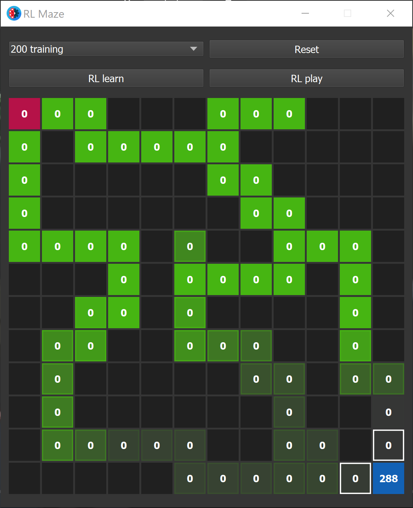

# ML Maze solver
<p align="left">


</p>

## Example of machine learning with simple Q-Learning.

### About :
You can create mazes by clicking on the boxes, set the parameters, start the AI learning, and replay the learned solution.

### Installation :
```bash
pip install requirements.txt
```
### Execution :
```bash
python main.text
```

### Screenshot :
<p align="center">

</p>
<p align="center">

</p>
<p align="center">

</p>
